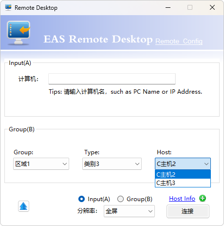

## 简介

该模块适用于windows远程桌面连接管理，通过配置远程主机连接信息，实现远程桌面连接；实现原理为生成rdp描述文件，唤起mstsc应用进程，从而实现一键远程的效果。

1、支持切换通用配置和个人配置；

2、支持输入和分组两种模式选择远程主机；

3、支持查看已注册的主机连接信息；

4、支持切换选择多种远程分辨率；

5、支持右键增删改查主机连接信息；


## 配置说明

### 远程主机信息配置

应用提供xml配置文件注册远程主机的连接信息：
- Remote_Config.xml：通用配置，可配合FTP服务实现多人配置共享；
- Personal_Config.xml：个人配置（默认），保存于本地，不共享；

```xml
<?xml version="1.0" encoding="utf-8"?>
<configuration>
  <!-- 配置分组级别1，支持多个 -->
  <factory name="区域一">
    <!-- 配置分组级别2，支持多个 -->
    <equipmenttype name="类别一">
      <!-- 配置远程主机信息，主机名、IP地址、用户名、密码、远程端口 -->
	    <ipconfig pcname="办公1" ipaddress="10.69.4.1" username="administrator" password="P@ssw0rd" port="3389" />
    </equipmenttype>
	  <equipmenttype name="类别二">
	    <ipconfig pcname="主机1" ipaddress="10.69.4.3" username="administrator" password="P@ssw0rd" port="3389" />
    </equipmenttype>
  </factory>
</configuration>
```

### FTP服务配置
- custom_config.ini：可配置是否开启FTP及FTP服务器信息；

```ini
[ftp]
ftp.enable=false
ftp.username=123
ftp.password=456
ftp.targetDir=ftp://10.79.4.2:21/RemoteDesktopConfig/
```

> FTP共享配置使用说明：
> 
> ①拷贝Remote_Config.xml到FTP服务器共享目录下；
> 
> ②修改custom_config.ini文件，设置ftp.enable=true，并配置FTP连接信息；
> 
> ③程序启动时将从FTP下载Remote_Config.xml，本地修改远程主机信息后将重新上传到FTP。

## 功能说明

- 页面功能说明


1、输入模式：输入已注册的主机名或IP地址，点击连接；


2、分组模式：通过分组选择主机，切换到Group(B)，点击连接；



3、点击Host_Info展示已注册的连接信息；


4、输入主机名关键字，匹配多个(2-10)时可通过弹窗选择；


5、右键可进行分组/类别/主机信息的增删改查；


